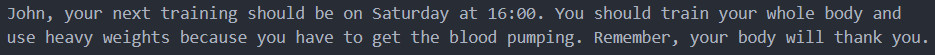
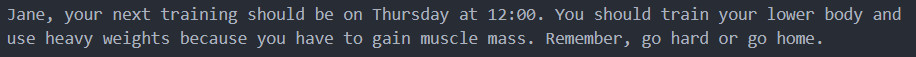

# Mixed Messages
This simple Node.js program outputs a random message each time it is run. Message is a plan for your next workout.

## Table of contents
* [General info](#general-info)
* [Screenshots](#screenshots)
* [Technologies](#technologies)
* [Features](#features)
* [Status](#status)
* [Inspiration](#inspiration)

## General info
Program is written in JavaScript and outputs a random message each time. User can enter his/her own name and a personalized workout plan is generated which is combined out of six parts (day of workout, time, body part to train, weight used, reason to workout and a motivation message). Message is logged to the console.

## Screenshots
Two examples of generated messages:

## Technologies
* node.js - version 12.19.0

## Features
* Program outputs a random personalized workout plan

## Status
Project is: _finished_

## Inspiration
Project is part of the CodeCademy Full Stack Engineer learning path.